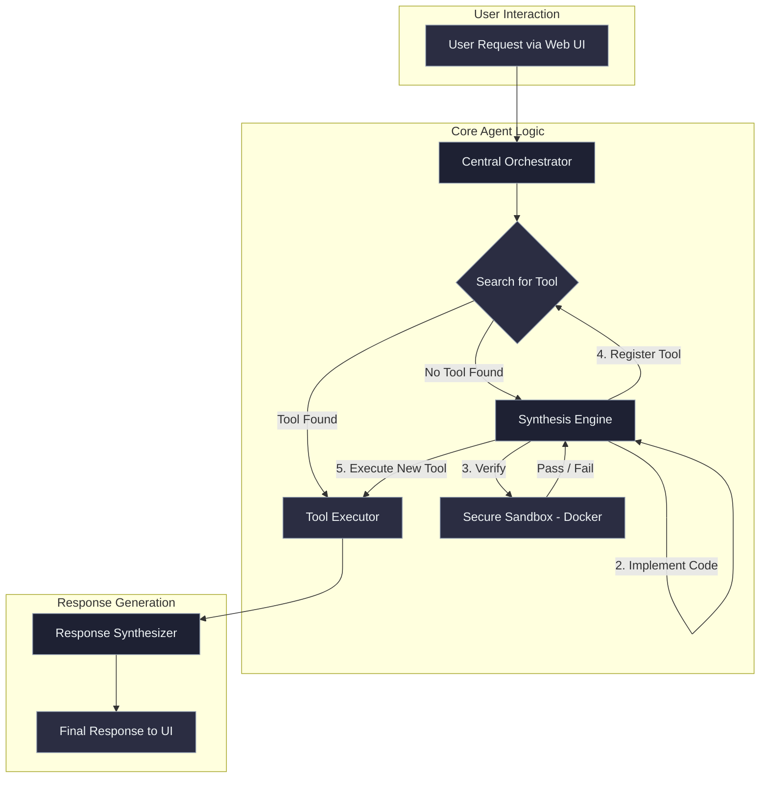

# Self-Engineering Agent Framework

An autonomous agent that doesn't just use a fixed set of tools, but actively and safely engineers new tools for itself in real-time using Test-Driven Development (TDD).

## Overview

When faced with a user request it cannot fulfill with existing capabilities, this agent enters a synthesis mode where it:

1.  **Defines requirements** for the missing tool
2.  **Writes unit tests** to ensure correctness (TDD)
3.  **Implements the code** to pass those tests
4.  **Verifies in a secure sandbox** (Docker container)
5.  **Integrates permanently** into its skillset for future use

The agent becomes more capable over time with every new tool it builds, effectively learning from interactions.

## Architecture



## Key Features

- **Self-Engineering**: Creates new tools autonomously when needed.
- **Test-Driven Development**: Every tool is tested before integration.
- **Security First**: All code runs in isolated Docker containers.
- **Intelligent Workflow Composition**: Automatically handles multi-tool queries with smart decomposition.
- **Pattern Learning**: Learns from usage to recognize and optimize common workflows.
- **Real-Time Visualization**: Web UI shows the entire synthesis and workflow execution process.
- **Semantic Search**: Uses vector embeddings to find relevant tools and patterns.
- **Reusability**: Tools and workflows persist and improve over time.
- **Modern Web Interface**: Responsive UI with WebSocket updates and workflow tracking.
- **Analytics Dashboard**: Monitor tool relationships, patterns, and system learning.

## Quick Start

### Prerequisites

- Python 3.10 or higher
- Docker Desktop (must be running)
- An OpenAI API key

### Installation

1.  **Clone the repository and navigate into the directory:**
    ```bash
    git clone https://github.com/your-repo/Self-Engineering-Agent-Framework.git
    cd "Self-Engineering Agent Framework"
    ```

2.  **Install dependencies:**
    ```bash
    pip install -r requirements.txt
    ```

3.  **Configure your environment:**
    Create a `.env` file in the root directory and add your API key. See `.env.example` for all options.
    ```env
    OPENAI_API_KEY=your_openai_api_key_here
    ```

4.  **Build the Docker sandbox image:**
    ```bash
    python -c "from src.sandbox import SecureSandbox; SecureSandbox().build_image()"
    ```

5.  **Seed initial tools (optional but recommended):**
    ```bash
    python seed_tools.py
    ```

6.  **Start the web server:**
    ```bash
    python web/app.py
    ```

7.  **Open the application in your browser:**
    Navigate to `http://localhost:5000`

## Usage Examples

### Example 1: Using an Existing Tool

-   **User Query**: "What is 15 percent of 300?"
-   **Agent Behavior**:
    1.  Searches capability registry.
    2.  Finds `calculate_percentage` tool with high similarity.
    3.  Executes the tool with extracted arguments.
    4.  Returns a natural language response: "15 percent of 300 is 45."

### Example 2: Creating a New Tool

-   **User Query**: "Reverse the string 'hello world'"
-   **Agent Behavior**:
    1.  Searches capability registry and finds no matching tool.
    2.  **Specification**: Defines the function signature `reverse_string(s: str) -> str`.
    3.  **Tests**: Generates unit tests for normal, empty, and single-character strings.
    4.  **Implementation**: Writes the Python code for the function.
    5.  **Verification**: Executes the tests in the secure Docker sandbox. All tests pass.
    6.  **Registration**: Saves the new tool's code and vector embedding.
    7.  **Execution**: Runs the newly created tool.
    8.  Returns the result: "The reversed string is 'dlrow olleh'."

## Project Structure

```
Self-Engineering Agent Framework/
├── src/
│   ├── orchestrator.py          # Central decision-making component
│   ├── capability_registry.py   # Vector DB storage & retrieval
│   ├── synthesis_engine.py      # TDD-based tool creation
│   ├── sandbox.py               # Docker-based secure execution
│   ├── executor.py              # Dynamic tool loading & execution
│   ├── response_synthesizer.py  # Natural language response generation
│   └── llm_client.py            # OpenAI API wrapper
├── tools/                        # Directory where generated tools are saved
├── web/
│   ├── app.py                   # Flask server with WebSocket support
│   ├── static/                  # CSS and JavaScript files
│   └── templates/               # HTML templates
├── docker/
│   └── sandbox.dockerfile       # Dockerfile for the secure sandbox
├── config.py                    # Application configuration
├── requirements.txt             # Python dependencies
├── .env.example                 # Template for environment variables
└── README.md                    # This file
```

## Configuration

All configuration is managed through environment variables defined in the `.env` file.

| Variable | Default | Description |
|---|---|---|
| `OPENAI_API_KEY` | **Required** | Your OpenAI API key. |
| `OPENAI_MODEL` | `gpt-4` | The LLM model to be used for generation. |
| `SIMILARITY_THRESHOLD`| `0.75` | Minimum similarity score for a tool to be considered a match (0-1). |
| `DOCKER_IMAGE_NAME` | `self-eng-sandbox` | Name for the sandbox Docker image. |
| `DOCKER_TIMEOUT` | `30` | Execution timeout in seconds for the sandbox. |
| `FLASK_PORT` | `5000` | Port for the local web server. |

## Security Considerations

-   **Code Isolation**: All generated code is executed in a sandboxed Docker container with no network access, read-only file system mounts, and strict resource limits (CPU, memory). Containers are destroyed immediately after execution.
-   **Test-Driven Verification**: New capabilities are only integrated into the agent's toolset after passing a comprehensive, self-generated test suite.
-   **API Key Management**: Sensitive keys are managed via a `.env` file, which should not be committed to version control.

## Limitations and Future Work

### Current Limitations
-   The synthesis process is limited to generating tools in Python.
-   The secure sandbox has network access disabled, preventing tools from making external API calls.
-   The agent processes requests sequentially.

### Potential Improvements
-   **Multi-language Support**: Extend the synthesis engine to generate tools in other languages (e.g., JavaScript).
-   **Tool Composition**: Implement a planner to allow the agent to chain multiple tools together to solve complex problems.
-   **Learning from Failure**: Enable the agent to analyze test failures and self-correct its code implementation.
-   **Tool Versioning**: Add a system to track and manage different versions of synthesised tools.
