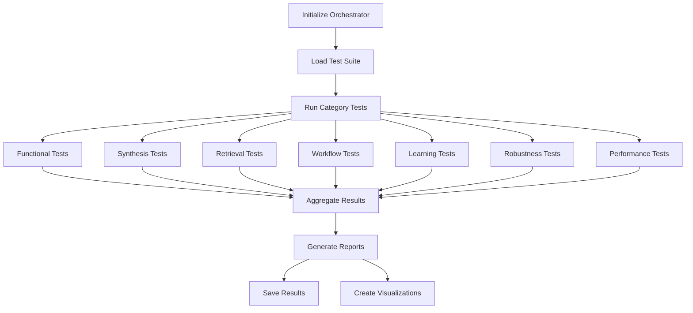

# Self-Engineering Agent - Comprehensive Evaluation Methodology

## Table of Contents
1. [Overview](#overview)
2. [Evaluation Framework Architecture](#evaluation-framework-architecture)
3. [Evaluation Categories](#evaluation-categories)
4. [ML-Inspired Metrics](#ml-inspired-metrics)
5. [Test Dataset](#test-dataset)
6. [Scoring System](#scoring-system)
7. [Running Evaluations](#running-evaluations)
8. [Interpreting Results](#interpreting-results)
9. [Best Practices](#best-practices)

---

## Overview

This evaluation framework provides a comprehensive, ML-inspired approach to measuring the performance of the Self-Engineering Agent across multiple dimensions. The evaluation methodology is designed to:

- **Measure functional correctness** - Does the agent produce correct outputs?
- **Assess synthesis quality** - Are synthesized tools well-written and tested?
- **Evaluate retrieval performance** - Can the agent find the right tools efficiently?
- **Test workflow execution** - Can the agent handle complex multi-tool tasks?
- **Measure learning capability** - Does the agent improve over time?
- **Verify robustness** - Can the agent handle edge cases and errors gracefully?
- **Benchmark performance** - Is the agent fast and resource-efficient?

### Key Principles

1. **Reproducibility**: All tests use fixed seeds and deterministic datasets
2. **Comprehensiveness**: Covers all major system components and capabilities
3. **ML-Inspired Metrics**: Uses standard ML evaluation methods (precision, recall, F1, MRR, NDCG, etc.)
4. **Real-World Scenarios**: Tests reflect actual usage patterns
5. **Continuous Improvement**: Framework designed to track progress over time

---

## Evaluation Framework Architecture

### Core Components

```
evaluation/
├── eval_framework.py          # Main evaluation orchestrator
├── tests/                     # Test suites by category
│   ├── test_functional.py
│   ├── test_synthesis.py
│   ├── test_retrieval.py
│   ├── test_workflow.py
│   ├── test_learning.py
│   ├── test_robustness.py
│   └── test_performance.py
├── test_dataset_generator.py  # Generates diverse test cases
├── visualization.py           # Creates charts and reports
├── run_evaluation.py          # Main execution script
└── results/                   # Evaluation results and reports
```

### Evaluation Flow



---

## Evaluation Categories

### 1. Functional Correctness (func_*)

**Purpose**: Verify that the agent produces correct outputs for given tasks.

**Tests**:
- Basic arithmetic operations (percentages, square roots, etc.)
- String manipulations (reversal, formatting)
- Mathematical functions (factorial, conversions)
- Edge cases (zero values, large numbers)

**Metrics**:
- Accuracy: Percentage of correct answers
- Success Rate: Percentage of successful executions
- Tool Reuse Rate: How often existing tools are used vs. new synthesis

**Example Test**:
```python
def test_percentage_calculation(self):
    query = "What is 25% of 100?"
    result = orchestrator.process_request(query)
    
    # Check correctness
    assert result['success'] == True
    assert '25' in result['response']
    
    # Score: 1.0 if correct, 0.0 otherwise
```

---

### 2. Synthesis Quality (synth_*)

**Purpose**: Evaluate the quality of tools synthesized by the agent.

**Tests**:
- Synthesis success rate
- Generated code quality (docstrings, type hints, structure)
- Test coverage and quality
- TDD process adherence
- Code parsability

**Metrics**:
- **Success Rate**: Percentage of successful syntheses
- **Code Quality Score**: Weighted average of:
  - Has docstring (30%)
  - Has type hints (30%)
  - Proper structure (20%)
  - No syntax errors (20%)
- **Test Quality Score**: Based on test count, edge cases, normal cases

**Quality Evaluation Criteria**:
```python
code_quality = {
    'has_docstring': 1.0 if docstring_present else 0.0,
    'has_type_hints': 1.0 if type_hints_present else 0.0,
    'proper_structure': 1.0 if well_structured else 0.0,
    'no_syntax_errors': 1.0 if parseable else 0.0
}

overall_score = sum(code_quality.values()) / len(code_quality)
```

---

### 3. Retrieval Performance (retr_*)

**Purpose**: Measure how well the agent finds and selects appropriate tools.

**Tests**:
- Exact match retrieval
- Semantic similarity matching
- Precision and recall
- Ranking quality (MRR)
- False positive rate
- Query variation handling

**ML-Inspired Metrics**:

#### Precision & Recall
```
Precision = True Positives / (True Positives + False Positives)
Recall = True Positives / (True Positives + False Negatives)
F1 Score = 2 * (Precision * Recall) / (Precision + Recall)
```

#### Mean Reciprocal Rank (MRR)
```
MRR = (1/N) * Σ(1/rank_i)
```
Measures how high the correct tool ranks in search results.

#### Normalized Discounted Cumulative Gain (NDCG)
```
DCG@k = rel_1 + Σ(rel_i / log2(i+1)) for i=2 to k
NDCG@k = DCG@k / IDCG@k
```
Measures ranking quality where position matters.

**Evaluation Example**:
```python
# Test precision/recall
test_cases = [
    ("calculate 50% of 200", "calculate_percentage"),
    ("reverse 'hello'", "reverse_string"),
    # ...
]

true_positives = 0
false_positives = 0
false_negatives = 0

for query, expected_tool in test_cases:
    tool_info = registry.search_tool(query)
    if tool_info and matches(tool_info['name'], expected_tool):
        true_positives += 1
    elif tool_info:
        false_positives += 1
    else:
        false_negatives += 1

precision = true_positives / (true_positives + false_positives)
recall = true_positives / (true_positives + false_negatives)
f1 = 2 * (precision * recall) / (precision + recall)
```

---

### 4. Workflow Execution (work_*)

**Purpose**: Evaluate multi-tool workflow capabilities.

**Tests**:
- Sequential workflow execution (independent tasks)
- Dependent workflow execution (data flow between tools)
- Workflow planning accuracy
- Pattern recognition and reuse
- Multi-step execution

**Metrics**:
- Workflow Success Rate
- Data Flow Accuracy (dependencies handled correctly)
- Planning Accuracy (correct complexity classification)
- Pattern Recognition Rate

**Workflow Complexity Levels**:
- **Simple**: Single tool, direct execution
- **Sequential**: Multiple independent tools
- **Composed**: Tools with data dependencies
- **Complex**: Multi-step with synthesis requirements

---

### 5. Learning & Adaptation (learn_*)

**Purpose**: Measure the agent's ability to learn and improve over time.

**Tests**:
- Tool reuse rate over repeated queries
- Learning curve (performance improvement)
- Pattern detection and storage
- Knowledge retention

**Metrics**:

#### Tool Reuse Rate
```
Reuse Rate = Reused Tools / (Reused Tools + Synthesized Tools)
```
Higher is better - indicates learning from past experiences.

#### Learning Curve
```
Improvement Rate = (Early_Avg_Time - Late_Avg_Time) / Early_Avg_Time
```
Measures speed improvement over repeated similar tasks.

#### Pattern Learning
- Number of patterns detected
- Pattern frequency
- Pattern success rate

**Example**:
```python
# Execute same type of query multiple times
queries = [
    "Calculate 10% of 100",
    "Calculate 20% of 200",
    "Calculate 30% of 300",
    # ...
]

synthesis_count = 0
reuse_count = 0

for query in queries:
    result = orchestrator.process_request(query)
    if result.get('synthesized'):
        synthesis_count += 1
    else:
        reuse_count += 1

reuse_rate = reuse_count / (synthesis_count + reuse_count)
# Target: > 70% reuse rate after first synthesis
```

---

### 6. Robustness & Edge Cases (robust_*)

**Purpose**: Test the agent's ability to handle errors, edge cases, and invalid inputs.

**Tests**:
- Malformed queries
- Edge case values (zero, negative, extreme)
- Error recovery
- Ambiguous queries
- Invalid inputs
- Graceful degradation

**Metrics**:
- Graceful Handling Rate: Percentage of edge cases handled without crashes
- Crash Rate: Percentage of tests that cause system crashes
- Safety Rate: Percentage of invalid inputs handled safely

**Edge Case Categories**:
```python
edge_cases = {
    'zero_values': ["0% of 100", "factorial of 0"],
    'invalid_inputs': ["factorial of -5", "sqrt of -1"],
    'malformed_queries': ["calculate", "reverse"],
    'ambiguous': ["do the thing", "calculate it"],
    'extreme_values': ["100% of 1000000"]
}
```

---

### 7. Performance & Efficiency (perf_*)

**Purpose**: Benchmark the agent's speed and resource utilization.

**Tests**:
- Simple query response time
- Complex query response time
- Memory efficiency
- Query throughput (QPS)
- Synthesis performance

**Metrics**:

#### Response Time Scoring
```python
def score_response_time(time_ms, query_type):
    if query_type == 'simple':
        if time_ms < 1000:   return 1.0  # Excellent
        if time_ms < 2000:   return 0.8  # Good
        if time_ms < 3000:   return 0.6  # Acceptable
        return 0.4  # Poor
    
    elif query_type == 'complex':
        if time_ms < 5000:   return 1.0  # Excellent
        if time_ms < 10000:  return 0.8  # Good
        if time_ms < 15000:  return 0.6  # Acceptable
        return 0.4  # Poor
```

#### Memory Efficiency
```
Memory Score = 1.0 - min(memory_increase_mb / 200, 1.0)
```

#### Throughput
```
Queries Per Second (QPS) = Total Queries / Total Time
Throughput Score = min(QPS / target_QPS, 1.0)
```

**Performance Targets**:
- Simple queries: < 3 seconds
- Complex queries: < 15 seconds
- Memory increase: < 200 MB per session
- Throughput: > 0.3 QPS

---

## ML-Inspired Metrics

### Information Retrieval Metrics

#### 1. Precision & Recall
- **Precision**: What fraction of retrieved tools are relevant?
- **Recall**: What fraction of relevant tools are retrieved?
- **F1 Score**: Harmonic mean of precision and recall

#### 2. Mean Reciprocal Rank (MRR)
- Measures how quickly the agent finds the correct tool
- Higher is better (1.0 = always finds correct tool first)

#### 3. Normalized Discounted Cumulative Gain (NDCG)
- Evaluates ranking quality
- Considers position of correct results
- Rewards correct tools appearing earlier

### Classification Metrics

#### 4. Accuracy
```
Accuracy = Correct Predictions / Total Predictions
```

#### 5. True/False Positive/Negative Rates
```
TPR (Recall) = TP / (TP + FN)
FPR = FP / (FP + TN)
TNR (Specificity) = TN / (TN + FP)
```

### String Similarity Metrics

#### 6. Levenshtein Distance
```python
def levenshtein_distance(s1, s2):
    # Minimum edit operations to transform s1 to s2
    # Used for code similarity comparison
```

#### 7. Cosine Similarity
```python
def cosine_similarity(vec1, vec2):
    # Similarity between embedding vectors
    # Used for semantic search evaluation
```

---

## Test Dataset

### Dataset Generation

The test dataset is automatically generated using `test_dataset_generator.py`, which creates diverse test cases across:

- **Complexity Levels**: Simple, Medium, Complex
- **Categories**: Arithmetic, String, Math, Conversion, Multi-tool
- **Edge Cases**: Zero, negative, extreme, invalid, ambiguous

### Dataset Structure

```json
{
  "metadata": {
    "total_cases": 56,
    "simple_count": 20,
    "medium_count": 15,
    "complex_count": 10,
    "edge_cases": 11,
    "seed": 42
  },
  "test_cases": [
    {
      "id": "simple_perc_1",
      "query": "Calculate 25% of 100",
      "category": "percentage_calculation",
      "complexity": "simple",
      "expected_behavior": "use_existing_tool",
      "expected_answer": 25.0,
      "requires_synthesis": false,
      "tags": ["percentage", "arithmetic"]
    },
    // ...
  ]
}
```

### Generating Custom Datasets

```python
from evaluation.test_dataset_generator import TestDatasetGenerator

generator = TestDatasetGenerator(seed=42)

dataset = generator.generate_full_dataset(
    num_simple=20,
    num_medium=15,
    num_complex=10,
    include_edge_cases=True
)

generator.save_dataset(dataset, "my_test_dataset.json")
```

---

## Scoring System

### Individual Test Scoring

Each test returns a score between 0.0 and 1.0:
- **1.0**: Perfect performance
- **0.8-0.9**: Excellent
- **0.7-0.8**: Good
- **0.6-0.7**: Acceptable
- **< 0.6**: Needs improvement
- **0.0**: Complete failure

### Category Scoring

Category score is the **average of all test scores** in that category:

```python
category_score = sum(test.score for test in category_tests) / len(category_tests)
```

### Overall Scoring

Overall score is the **weighted average** of category scores:

```python
overall_score = (
    functional_score * 0.25 +
    synthesis_score * 0.20 +
    retrieval_score * 0.15 +
    workflow_score * 0.15 +
    learning_score * 0.10 +
    robustness_score * 0.10 +
    performance_score * 0.05
)
```

### Pass Criteria

- **Test Level**: Individual test passes if score ≥ 0.7
- **Category Level**: Category passes if average score ≥ 0.7
- **Overall**: System passes if overall score ≥ 0.7 and no critical failures

---

## Running Evaluations

### Quick Start

```bash
# Run full evaluation suite
python evaluation/run_evaluation.py

# Run specific categories
python evaluation/run_evaluation.py --categories functional synthesis retrieval

# Generate visualizations
python evaluation/run_evaluation.py --visualize

# Don't save results
python evaluation/run_evaluation.py --no-save

# Custom output directory
python evaluation/run_evaluation.py --output-dir ./my_results
```

### Programmatic Usage

```python
from src.orchestrator import AgentOrchestrator
from evaluation.eval_framework import EvaluationFramework

# Initialize
orchestrator = AgentOrchestrator()
framework = EvaluationFramework(orchestrator)

# Run evaluation
results = framework.run_evaluation(
    test_suite=['functional', 'synthesis'],
    save_results=True
)

# Access results
print(f"Pass Rate: {results['summary']['pass_rate']:.1%}")
print(f"Average Score: {results['summary']['average_score']:.3f}")

# Category scores
for category, score in results['summary']['category_scores'].items():
    print(f"{category}: {score:.3f}")
```

### Comparing Results

```bash
# Compare two evaluation runs
python evaluation/run_evaluation.py --compare \
    results/evaluation_20250101_120000.json \
    results/evaluation_20250102_120000.json
```

---

## Interpreting Results

### Result Files

Each evaluation generates:

1. **JSON Results** (`evaluation_YYYYMMDD_HHMMSS.json`)
   - Complete test results
   - Detailed metrics
   - Individual test outcomes

2. **Visualizations** (if --visualize flag used)
   - `category_scores.png`: Bar chart of category scores
   - `test_distribution.png`: Pass/fail distribution
   - `performance.png`: Performance metrics

3. **HTML Report** (`report.html`)
   - Interactive web report
   - Detailed test breakdown
   - Visual score indicators

### Key Metrics to Monitor

#### System Health
- **Pass Rate**: Should be > 80%
- **Average Score**: Should be > 0.70
- **Crash Rate**: Should be 0%

#### Performance
- **Simple Query Time**: < 3 seconds
- **Complex Query Time**: < 15 seconds
- **Memory Usage**: < 200 MB increase
- **QPS**: > 0.3 queries/second

#### Learning
- **Tool Reuse Rate**: > 70%
- **Pattern Recognition**: Increasing over time
- **Learning Curve**: Positive improvement rate

#### Synthesis Quality
- **Synthesis Success Rate**: > 80%
- **Code Quality Score**: > 0.70
- **Test Coverage**: > 60%

### Identifying Issues

| Issue | Possible Causes | Solutions |
|-------|----------------|-----------|
| Low functional scores | Tool bugs, incorrect logic | Review generated tools, improve prompts |
| Low retrieval scores | Poor embeddings, low similarity threshold | Adjust threshold, improve docstrings |
| Low synthesis scores | Poor code generation, inadequate tests | Improve synthesis prompts, validate outputs |
| High response times | Inefficient code, too many retries | Optimize tool code, reduce retries |
| Low learning scores | Not storing patterns, poor reuse | Check workflow tracker, verify DB storage |
| High failure rate | Edge cases, error handling | Add error handling, validate inputs |

---

## Best Practices

### 1. Regular Evaluation

- Run full evaluations **weekly** to track progress
- Run quick checks (functional + performance) **daily** during development
- Save all evaluation results for historical comparison

### 2. Regression Testing

- Compare each run against baseline
- Flag any category score drops > 10%
- Investigate failed tests immediately

### 3. Continuous Improvement

```python
# Track improvement over time
baseline_score = 0.75
current_score = results['summary']['average_score']
improvement = (current_score - baseline_score) / baseline_score

if improvement > 0.10:
    print(" Significant improvement!")
elif improvement < -0.05:
    print("⚠ Performance regression detected")
```

### 4. Custom Test Development

Add domain-specific tests:

```python
class CustomTests:
    def test_domain_specific(self):
        # Your custom test
        query = "Your domain-specific query"
        result = self.orchestrator.process_request(query)
        
        # Validate
        assert result['success']
        assert expected_value in result['response']
        
        return EvaluationResult(
            test_id="custom_001",
            test_name="Domain Specific Test",
            category=MetricCategory.FUNCTIONAL,
            passed=True,
            score=1.0,
            metrics={},
            execution_time_ms=100
        )
```

### 5. Dataset Maintenance

- Update test dataset quarterly
- Add new edge cases as discovered
- Remove outdated tests
- Balance dataset across categories

### 6. Visualization Analysis

- Review visualizations for patterns
- Look for category imbalances
- Identify performance outliers
- Track trends over multiple runs

### 7. Documentation

- Document each evaluation run with context
- Note any system changes before/after
- Track external factors (API changes, model updates)
- Maintain changelog of improvements

---

## Advanced Topics

### Statistical Significance

For comparing two evaluation runs:

```python
from scipy import stats

# Collect scores from both runs
scores_run1 = [test['score'] for test in run1['detailed_results']]
scores_run2 = [test['score'] for test in run2['detailed_results']]

# Paired t-test
t_statistic, p_value = stats.ttest_rel(scores_run1, scores_run2)

if p_value < 0.05:
    print("Difference is statistically significant")
```

### A/B Testing

Compare different configurations:

```python
# Test with different similarity thresholds
thresholds = [0.3, 0.4, 0.5, 0.6, 0.7]
results = {}

for threshold in thresholds:
    Config.SIMILARITY_THRESHOLD = threshold
    orchestrator = AgentOrchestrator()
    framework = EvaluationFramework(orchestrator)
    results[threshold] = framework.run_evaluation()

# Find optimal threshold
best_threshold = max(results, key=lambda t: results[t]['summary']['average_score'])
```

### Load Testing

Evaluate under load:

```python
import concurrent.futures

def run_concurrent_queries(num_workers=5, queries_per_worker=10):
    with concurrent.futures.ThreadPoolExecutor(max_workers=num_workers) as executor:
        futures = []
        for _ in range(num_workers):
            for query in test_queries:
                future = executor.submit(orchestrator.process_request, query)
                futures.append(future)
        
        results = [f.result() for f in concurrent.futures.as_completed(futures)]
    
    return results
```

---

## Conclusion

This evaluation framework provides a comprehensive, ML-inspired approach to measuring agent performance across all dimensions. By regularly running evaluations and analyzing results, you can:

- Track progress over time
- Identify weaknesses and strengths
- Validate improvements
- Ensure consistent quality
- Benchmark against baselines
- Make data-driven decisions

The framework is designed to be:
- **Extensible**: Easy to add new tests and categories
- **Reproducible**: Deterministic results with fixed seeds
- **Comprehensive**: Covers all system aspects
- **Actionable**: Clear metrics and recommendations
- **Automated**: Minimal manual intervention required

For questions or issues, please refer to the main project documentation or open an issue on GitHub.

---

**Last Updated**: October 27, 2025  
**Version**: 1.0.0  
**Author**: Self-Engineering Agent Framework Team

